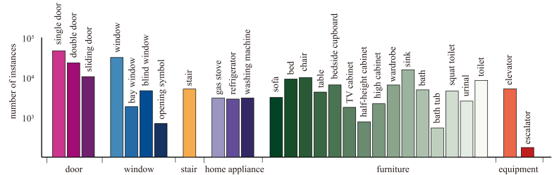

# Overview

Number of finely annotated instances (y-axis) for 28 thing classes and their associated categories (x-axis)

Our FloorPlanCAD is the only one that gives panoptic annotation while retaining the characteristics of vector graphics throughout the process.

# Classes

## Things

## Stuff

[back](./)
