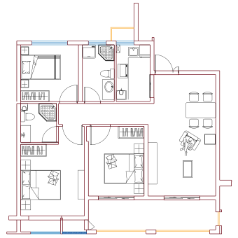
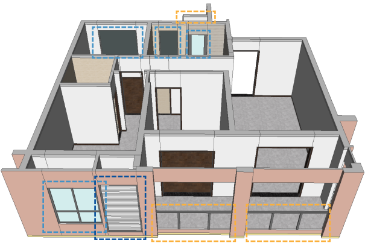
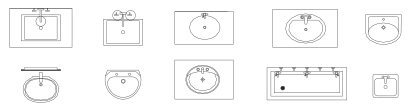
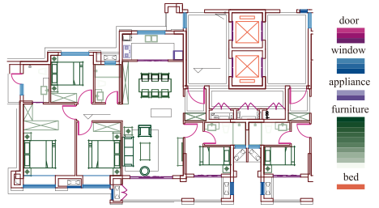
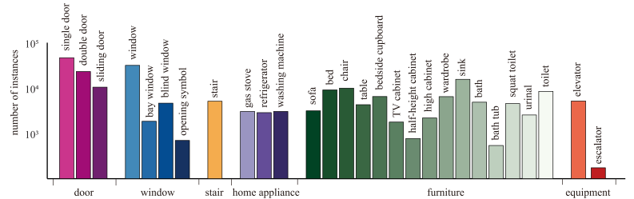

# Abstract

Access to large and diverse computer-aided design (CAD) drawings is critical for developing symbol spotting algorithms.
In this paper, we present FloorPlanCAD, a large-scale real-world CAD drawing dataset containing over 10,000 floor plans, ranging from residential to commercial buildings.
CAD drawings in the dataset are all represented as vector graphics, which enable us to provide line-grained annotations of 30 object categories.
Equipped by such annotations, we introduce the task of ***panoptic symbol spotting***, which requires to spot not only instances of countable things, but also the semantic of uncountable stuff.

Our contributions are three-fold: 1) to the best of our knowledge, the presented CAD drawing dataset is the first of its kind; 2) the panoptic symbol spotting task considers the spotting of both thing instances and stuff semantic as one recognition problem; and 3) we presented a baseline solution to the panoptic symbol spotting task based on a novel CNN-GCN method, which achieved SOTA performance on semantic symbol spotting. 
We believe that these contributions will boost research in related areas.

# Introduction

## Motivation

The rich semantic, accurate location and detailed 3D shape (right top) of windows (light blue),
blind windows (blue), railings (orange) and walls (dark red) are faithfully encoded in the CAD drawings of a floor plan (left) and its south facade (right bottom).

## Symbols

Various sink symbols from our FloorPlanCAD dataset.
The style and appearance of a symbol depend on the producer of the drawing.

## Annotation

A snapshot of our FloorPlanCAD dataset. (a) Texts are removed to protect privacy and intellectual property. (b) The line-grained annotations is illustrated by colors.

Number of finely annotated instances (y-axis) for 28 thing classes and their associated categories (x-axis)

## Samples

Detailed classes can be found [here](./classes-page.html)

# Methods

## PanCADNet

Aiming to solve this task, we propose a novel method by combining Graph Convolutional Networks (GCNs) with Convolutional Neural Networks (CNNs), which captures both non-Euclidean and Euclidean features and can be trained end-to-end.
The proposed CNN-GCN method achieved state-of-the-art (SOTA) performance on the task of semantic symbol spotting, and help us build a baseline network for the panoptic symbol spotting task.

# Contributors
